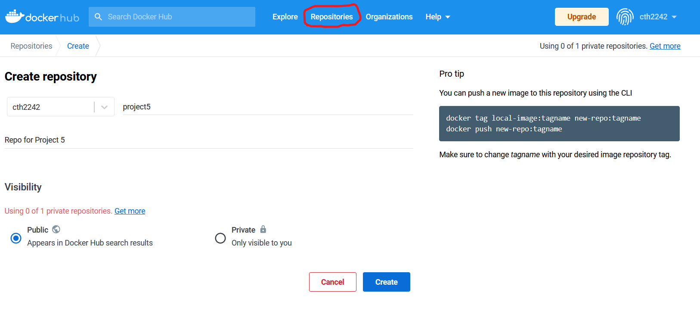
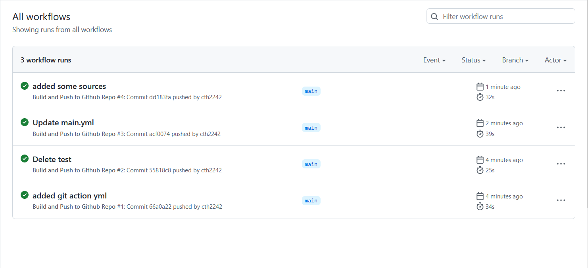

# Project 5

## Project Overview
The purpose of this project is to get hands on experience with containerizing an application with Docker, usign Github Actions to automate project pipelines, and using webhooks to keep my applications up to date. 

## Run Project Locally

- How you installed docker + dependencies (WSL2, for example)
    - My PC already had WSL2 and the Linux kernel update installed
    - I installed Docker Desktop. I did not change any setting from the defaults during installation. After the installation was complete I restarted my PC. 
    - After Docker Desktop was installed, I started the program and navigated to Settings > General. Once there, I made sure that Use WSL 2 based engine was selected. The Use WSL 2 based engine was selected my default so I then exited out of Docker Desktop.
    - I then went into MobaXterm and used `docker pull httpd` to test if Docker was working. 

- How to build the container from the Dockerfile
    - I built my container with `docker build . -t attempt1`
- How to run the container
    - I ran my container with `docker run -d --name project5 -p 80:80 attempt1`
    - I added I specified the port bind because even though my Dockerfile is supposed to expose port 80, I was unable to view my webpage. By adding `-p 80:80` I am able to view my website. 
- How to view the project running in the container (open a browser...go to ip and port...)
    - I am able to view my project by going to 127.0.0.1 in my web browser.
    

### Source Used
- [Installing Docker on My Windows Machine](https://docs.docker.com/desktop/windows/wsl/)
- [Creating my Dockerfile](https://docs.docker.com/engine/reference/builder/)
- [Guide on creating an Apache Dockerfile](https://www.theserverside.com/blog/Coffee-Talk-Java-News-Stories-and-Opinions/How-to-dockerize-Apache-httpd-web-servers)

## DockerHub
- Process to create public repo in DockerHub
    - The first step is to sign into Dockerhub on your browser. Next you will click `Repositories` at the top of the page. Next you will click `Create repository` on the left side of the screen. This will bring you to a page where you will name your repo, give a description of the repo, and choose if you want it to be public or private. After filling out this information you will click `Create` at the bottom right of the screen. 

    
- How to authenticate with DockerHub via CLI using Dockerhub credentials
    - The best way to authenticate yourself via CLI is to use a Dockerhub Access Token. Access tokens provide better security than a normal password. Instead of using one password on multiple machines, you can create multiple tokens for multiple machines. This grants you better access control by allowing you to disable/delete tokens for the machines as needed. Machines that are signed in via access tokens will also prevent users from performing admin actions such changing passwords. 
    - The first step is to create a Dockerhub Access Token. You do this by going into your Account Settings and navigating to the security options. Select New Access Token in the Access Token section. Select a name for the access token and the permissions that the token will provide. After this you will be presented with your access token. You can only view this token once so make sure to save
    - The next step is to sign in on your command line. I did this by using `docker login -u cth2242`. You will then be prompted to provide a password. You will paste in the access token you got from Dockerhub.
- How to push container to Dockerhub
    - The first step is to name my local image using my Dockerhub username and the repo name. There are multiple ways to do this, I chose to do this by using `docker commit project5 cth2242/project5`. I did not specify a tag because I chose to use the default tag name of latest. 
    - Finally I pushed the container to my Dockerhub repo by using `docker push cth2242/project5`. 

### Source Used
- [Dockerhub Documentation on Access Token ](https://docs.docker.com/docker-hub/access-tokens/#create-an-access-token)
- [Dockerhub Documentation on Repos](https://docs.docker.com/docker-hub/repos/)

## Github Action
- Configuring GitHub Secrets
  - To make my Github Action work I had to add two secrets to my repository. The first secret is called `DOCKER_HUB_USERNAME` and it is my Dockerhub ID. The other secret is called `DOCKER_HUB_ACCESS_TOKEN` and it is the access token I created in the last task. 
  - I added these secrets by entering my repo's settings and selecting Secrets > Actions on the left side of the screen. You will then select New repository secret. You will enter a name for the secret and the secret's value then select Add secret.

- Behavior of GitHub workflow
  - what does it do and when
    - The workflow I created signs into my Dockerhub account, builds a container from the image in my Github repo, and pushes it to my Dockerhub repo. This action takes place every time I make a commit to the main branch of my Github repo.

    
  - what variables in workflow are custom to your project
    - There are three custom variables in my workflow. The first two are the Github secrets I had to create to sign into my Docker account. The last variable I had to create was I had change was the repo name to the Dockerhub repo. If others wanted to use my script this would be the only variable that they would have to change. 

### Sources Used
[Github Documentation on Actions](https://docs.github.com/en/actions/quickstart)
[Docker Documentation on Actions](https://docs.docker.com/build/ci/github-actions/)

## Deployment
- Description of container restart script
- Setting up a webhook on the server
  - How you created you own listener
  - How you installed the [webhook on GitHub](https://github.com/adnanh/webhook)
  - How to keep the webhook running if the instance is on
- Description of Webhook task definition file
- Steps to set up a notifier in GitHub or DockerHub